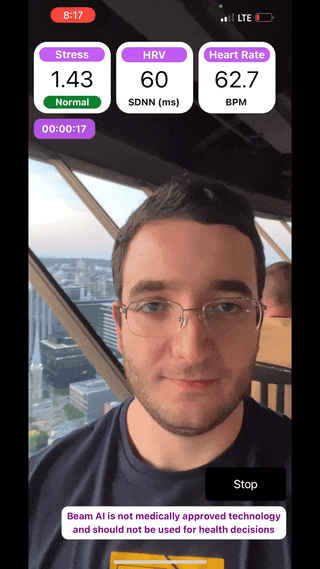
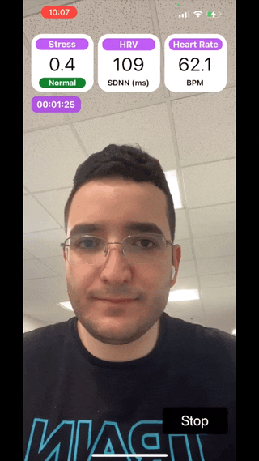

# Beam AI Lite (iOS)

This repository contains the source code for [Beam AI Lite](https://apps.apple.com/ca/app/beam-ai-lite/id1629758948) built using the [BeamAISDK](https://github.com/beamai/BeamAISDK-iOS). With [Beam AI Lite](https://apps.apple.com/ca/app/beam-ai-lite/id1629758948), users can monitor their stress, heart rate and heart rate variability through the selfie camera in real-time. You can download [Beam AI Lite](https://apps.apple.com/ca/app/beam-ai-lite/id1629758948) from App Store.



## How Does It Work?

The core stress monitoring technology comes from the [BeamAISDK](https://github.com/beamai/BeamAISDK-iOS) which enables iOS apps to monitor the user's heart rate, heart rate variability and stress through the selfie-camera. Our technology extracts the user’s pulse wave by analyzing subtle color variations across the skin regions of the user’s face. The user’s pulse is then used to determine stress, heart rate, and heart rate variability. To determine stress, we analyze the variability of the user's heartbeats according to the Baevsky Stress Index which has been shown to provide an accurate quantitative measure of physiological stress.

This is one of the two sample projects provided by [Beam AI](https://www.beamhealth.ai/). To explore how the [BeamAISDK](https://github.com/beamai/BeamAISDK-iOS) can be used to monitor user stress as they browse the web, see [Beam AI Browser](https://apps.apple.com/ua/app/beam-ai-browser/id1629793784). You can find [Beam AI Browser](https://apps.apple.com/ua/app/beam-ai-browser/id1629793784)'s source code [here on GitHub](https://github.com/beamai/BeamAIBrowser-iOS).

## Setup & Run (in less than 15 minutes)

1. Clone this repository and open it up in Xcode.
2. Update the beamID on line 53 of ViewController.swift. You will need a beamID to be able to use the BeamAISDK. You can sign up to get your beamID [here](https://docs.google.com/forms/d/e/1FAIpQLSdyat4fn2PC-IjLDndCLVQPH4QjgwuuFEBT5QXJJ8KK4I9OFA/viewform).

```
self.beamAI = try! BeamAI(beamID: "your-20-char-beamID", frameRate: 30, window: 60.0, updateEvery: 1.0)
```

3. Update app team to your App Store developer account, and deploy onto an iPhone device.
4. Enjoy the build and race to build the super cool application you are thinking about 😎!

## Contact

For feature requests, questions and support, please open a GitHub issue. For all other inquiries, please email us directly at [contact@beamhealth.ai](contact@beamhealth.ai)!


